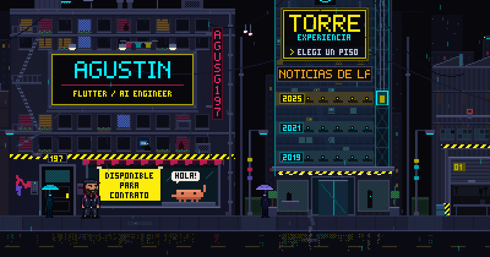

# agusg197.github.io

Mi portafolio: **[agusg197.github.io](https://agusg197.github.io)**

Flutter web con estética cyberpunk. Siete proyectos que se recorren etapa por etapa
—con los datos que escribe el visitante— y cada uno con sus números medidos.



---

## Qué tiene de distinto

**Los proyectos se caminan, no se leen.** Cada ficha trae un recorrido de etapas y una
entrada de texto: el visitante escribe algo suyo y ve qué le hace cada etapa. El detector
de preguntas de Echo, por ejemplo, es el mismo criterio que corre en la app de escritorio,
portado tal cual. Todo local, sin una sola llamada a ninguna API, y la pantalla lo dice.

**Dos perfiles, un contenido.** El mismo trabajo contado como Flutter y como AI Engineer:
cambian la biografía, los números, el orden de los proyectos, las skills y el CV que se
descarga. El cambio se anuncia con un barrido, porque una página que se reescribe entera
sin avisar parece rota.

**Se pregunta el idioma.** En la primera visita, un panel ofrece castellano e inglés
escrito en los dos: preguntar en uno solo ya es elegir por el visitante. Al pasar el
puntero, el panel muestra cómo va a quedar.

**Todo se puede apagar.** Glitch, partículas, cursor y textura CRT tienen tres
intensidades. En la más baja no se congela la animación: se dibuja un frame compuesto a
propósito, que es distinto.

---

## Cómo está hecho

| | |
|---|---|
| Framework | Flutter 3.47 · Dart 3.13 · web (CanvasKit) |
| Estado | Riverpod 3 |
| Rutas | go_router con `#`, para que un hosting estático no necesite reescrituras |
| Efectos | `CustomPainter` + tickers propios; nada de paquetes de animación |
| Contenido | un JSON: `assets/data/portfolio.json` |
| Tipografías | empaquetadas; el sitio no le pide nada a Google en cada visita |
| Publicación | GitHub Actions → GitHub Pages en cada push a `main` |

Alrededor de 12.000 líneas de Dart en 49 archivos.

### Rendimiento, medido

Los fondos son lo más caro de una interfaz así, y se midieron con un `Canvas` que cuenta
operaciones en vez de mirar el frame rate:

| | Antes | Ahora |
|---|---|---|
| Campo de partículas | 614 llamadas de dibujo | **11** |
| Textura CRT | 625 | **9** |
| Grilla del hero | 82 llamadas + 5 `saveLayer` | 82 + **0** |

Las técnicas: agrupar puntos y líneas en `drawRawPoints` por opacidad, cachear shaders y
buffers en vez de crearlos en cada `paint`, resolver las líneas de barrido con un gradiente
repetido en un solo rectángulo, y apagar los tickers de lo que no está en pantalla.

El test que lo mide está en [`test/paint_cost_test.dart`](test/paint_cost_test.dart): si
alguien vuelve a dibujar de a una línea, el número salta y se ve.

---

## Correrlo

```bash
flutter pub get
flutter run -d chrome
```

El laboratorio de efectos, con cada pieza aislada y sus controles, está en `/#/lab`.

```bash
flutter analyze   # sin issues
flutter test      # el costo de dibujo de los fondos
```

---

## El contenido vive en un JSON

Nada del contenido está escrito en el código. Todo sale de
[`assets/data/portfolio.json`](assets/data/portfolio.json): la persona, los dos perfiles
con sus skills y CV, la experiencia, y los proyectos con su recorrido, su tabla de
resultados y sus capturas. Cada texto es un par `{es, en}`.

Agregar un proyecto es agregar un objeto. Solo hace falta tocar Dart si el proyecto trae
una simulación nueva, que vive en
[`lib/features/projects/project_demos.dart`](lib/features/projects/project_demos.dart).

---

## Herramientas

Scripts que no son parte del sitio pero lo alimentan:

| | |
|---|---|
| `tool/build_presentacion.py` | arma un dossier en PDF desde el mismo JSON |
| `tool/render_icons.py` | genera el favicon y los íconos de la PWA |
| `tool/cv_sin_telefono.py` | publica los CV sin el teléfono |
| `tool/render_advisor_shots.py` | capturas de terminal para el proyecto que no tiene pantallas |
| `tool/redact_leadbox_shots.py` | tapa marca e identificadores en las capturas de un proyecto laboral |

---

## Documentos

- [`PLAN.md`](PLAN.md) — las decisiones de diseño y qué se descartó
- [`DEPLOY.md`](DEPLOY.md) — cómo se publica y qué revisar antes

---

Hecho en Córdoba, Argentina.
